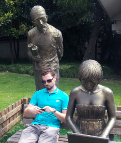

Hi and welcome to my website.

My name is Niko Višnjić.
Apart from the unusually looking characters in my surname, I'm quite your everyday technology tinkerer. 
On a regular day or night you'll usually find me testing out some new feature I want to implement in hardware or software, sometimes both.
I thoroughly enjoy making things come to life and strive to learn as much as I can on the way.
Things I find worth sharing can usually be found in the post section. Feel free to check it out.

For more information on my professional life, head on over to [LinkedIn](http://www.linkedin.com/in/nikovisnjic).

[GitHub](https://github.com/nvisnjic) is a good place to look for some juicy code snippets.

If in doubt or simply want to share something, feel free to drop me a line or two on visnjic.niko[at]gmail.com
